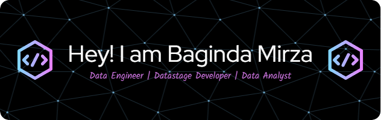

# Welcome to my GitHub page! I’m Baginda Mirza – excited to share my work with you! 👋

<!--
**mirzabaginda/mirzabaginda** is a ✨ _special_ ✨ repository because its `README.md` (this file) appears on your GitHub profile.

Here are some ideas to get you started:

- 🔭 I’m currently working on ...
- 🌱 I’m currently learning ...
- 👯 I’m looking to collaborate on ...
- 🤔 I’m looking for help with ...
- 💬 Ask me about ...
- 📫 How to reach me: ...
- 😄 Pronouns: ...
- ⚡ Fun fact: ...
-->

- 🔭 I’m currently working on various data engineering and programming projects, including building automation systems for business processes and developing efficient data management solutions.
 
- 🌱 I’m enhancing my skills in AI, data analysis, and data engineering. Currently, I’m diving deeper into machine learning models, automation techniques, and etl development.
 
- 👯 I’m open to collaborating on projects related to data analysis, data engineering and AI-powered applications. Feel free to reach out if you're working on a project in these areas!
 
- 🤔 I'm looking for guidance on advanced machine learning models and automation techniques to optimize business workflows and customer service systems. If you're an expert in this area, I’d love to learn from you!
 
- 💬 Ask me about data analysis, etl development, or anything related to automation systems. I enjoy discussing tech strategies, data-driven solutions, and creative applications of machine learning.
 
- 📫 You can reach me via email at [your-email@example.com] or connect with me on LinkedIn: [linkedin.com/bagindamirza].
 
- ⚡ Fun fact: ...
I’m passionate about space exploration, animals, and the ocean—so I’m always down for a conversation about the wonders of the universe!
